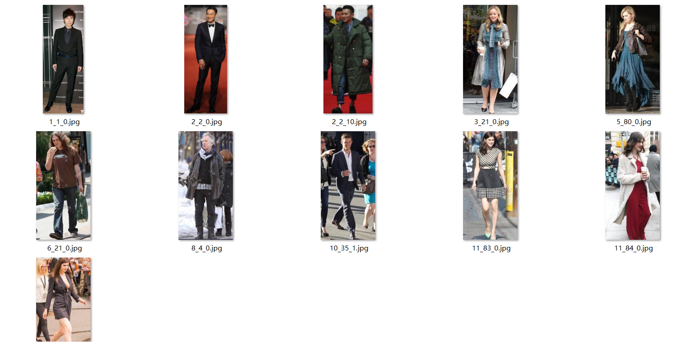
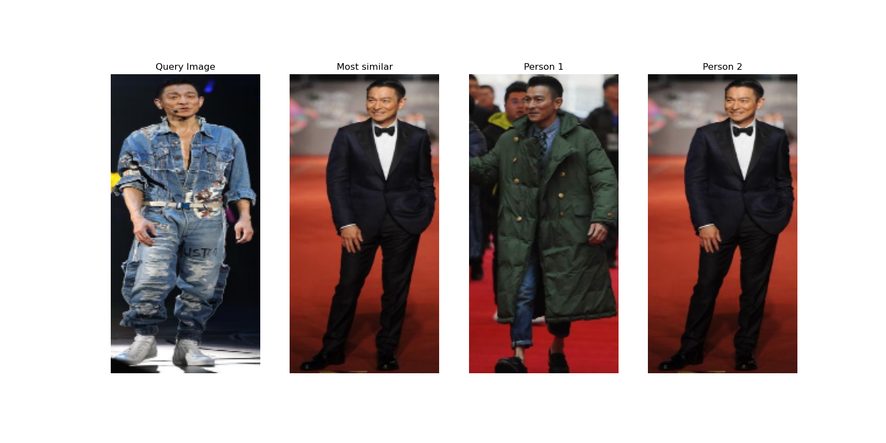

本项目的行人重识别是出自论文"Beyond Scalar Neuron: Adopting Vector-Neuron Capsules for Long-Term Person Re-Identification"

该文章所涉及到的相关理论讲解可以参考我的文章：[Reid系列论文学习——换装Reid](https://blog.csdn.net/z240626191s/article/details/139841361?spm=1001.2014.3001.5502)

不过经过本人测试，论文开源的代码有一些bug，同时也没有关于实际图像测试的代码，因此我对这个项目代码进行了完善。
———————————————

# 环境

```
torch>=1.7.0
torchvision>=0.8.0
matplotlib==3.4.3
numpy==1.21.6
```

# 权重链接

链接：[权重链接](https://pan.baidu.com/s/11EJlZ0OmP9MIEyj8-UHxkw)
提取码：yypn 


# 数据集

**该数据集有1052个ID，34186张图像，数据集链接：**

链接：[Celeb-reid数据集](https://pan.baidu.com/s/10hiMH5ORDz6t-spBPE7Gwg ) 
提取码：yypn 

数据集详情：

| split   | training | query | gallery | total  |
| ------- | -------- | ----- | ------- | ------ |
| #ID     | 632      | 420   | 420     | 1,052  |
| #Images | 20,208   | 2,972 | 11,006  | 34,186 |

将数据集下载好后放置datasets中,并运行以下脚本进行身体部位的划分：

`python split_data.py`

得到目录形式如下：

```
datasets/
|-- celeb
    |-- gallery
    |-- gallery_1_1
    |-- gallery_1_2
    |-- gallery_1_3
    |-- gallery_2_1
    |-- gallery_2_2
    |-- query
    |-- query_1_1
    |-- query_1_2
    |-- query_1_3
    |-- query_2_1
    |-- query_2_2
    |-- train
    |-- train_1_1
    |-- train_1_2
    |-- train_1_3
    |-- train_2_1
    `-- train_2_2

```

## Reid训练

由于该部分训练牵扯到了人员身体各个部分的训练，因此项目提供了训练脚本可以快速开启训练，修改**run_train.sh**中的数据集路径后并运行脚本:

```
#!/bin/sh
 
python train.py --train_path '/datasets/celeb/train' --gallery_path '/datasets/celeb/gallery' --query_path '/datasets/celeb/query' --logs-dir 'log_celeb_all'
 
python train.py --train_path '/datasets/celeb/train_1_1' --gallery_path '/datasets/celeb/gallery_1_1' --query_path '/datasets/celeb/query_1_1' --logs-dir 'log_celeb_11' --epochs 50 --step_size 40
 
python train.py --train_path '/datasets/celeb/train_1_2' --gallery_path '/datasets/celeb/gallery_1_2' --query_path '/datasets/celeb/query_1_2' --logs-dir 'log_celeb_12' --epochs 50 --step_size 40
 
python train.py --train_path '/datasets/celeb/train_1_3' --gallery_path '/datasets/celeb/gallery_1_3' --query_path '/datasets/celeb/query_1_3' --logs-dir 'log_celeb_13' --epochs 50 --step_size 40
 
python train.py --train_path '/datasets/celeb/train_2_1' --gallery_path '/datasets/celeb/gallery_2_1' --query_path '/datasets/celeb/query_2_1' --logs-dir 'log_celeb_21' --epochs 50 --step_size 40
 
python train.py --train_path '/datasets/celeb/train_2_2' --gallery_path '/datasets/celeb/gallery_2_2' --query_path '/datasets/celeb/query_2_2' --logs-dir 'log_celeb_22' --epochs 50 --step_size 40
```

运行上述脚本后可开启训练。训练详细代码的实现可以看train.py 

训练完成的各部分权重会保存在以下文件中：

```shell
log_celeb_11
log_celeb_12
log_celeb_13
log_celeb_21
log_celeb_22
log_celeb_all
```

## 测试

测试代码在test.py中，该脚本可用于**评价指标的复现**。并不是检测图像！！

其中--part_train参数是训练好的各身体部分权重路径。

快速开启测试：

```bash
python test.py
```

测试结果如下：

| mAP   | rank-1 | rank-5 |
| ----- | ------ | ------ |
| 15.8% | 63.0%  | 76.3%  |

## 图像检测

图像检测核心代码在predict.py中。

在检测之前需要将query人员放置在query文件夹中(比如我要从一堆人里找刘德华)，然后gallery就是"人群图像集"，运行split_data.py脚本进行身体部分的划分，然后就可以运行predict.py了。其中gallery中的人群图像集如下，我要的是从人群中把换装后的刘德华找出来。

```
python predict.py --dist_thres 1.5
```



最终效果图如下图所示：

query Image是待检测人员，Most similar是最像的(准确度最高的) (该部分有偿提供)



CSDN博客：[CSDN博客](https://blog.csdn.net/z240626191s/article/details/139924468?csdn_share_tail=%7B%22type%22%3A%22blog%22%2C%22rType%22%3A%22article%22%2C%22rId%22%3A%22139924468%22%2C%22source%22%3A%22z240626191s%22%7D)

